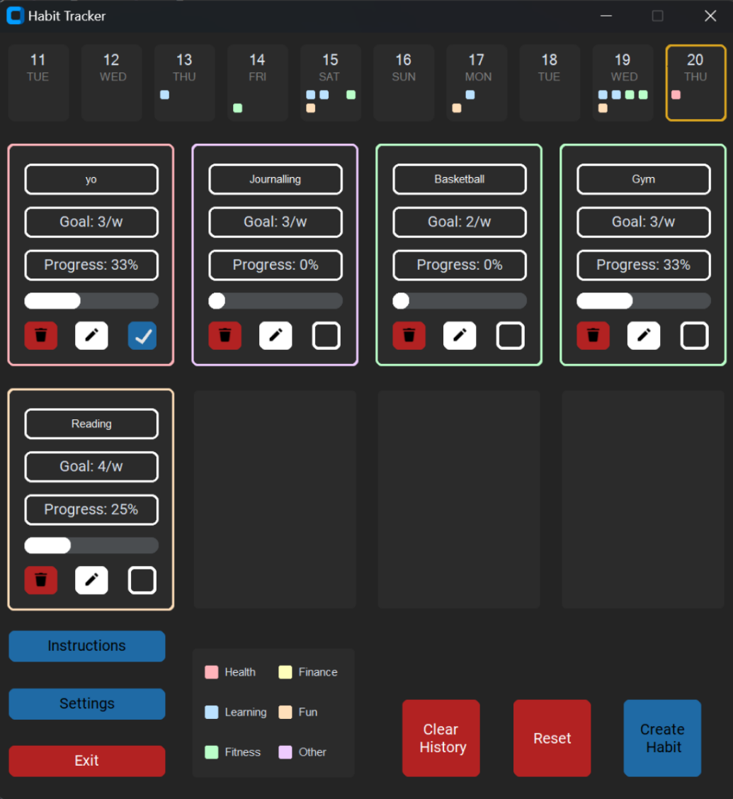
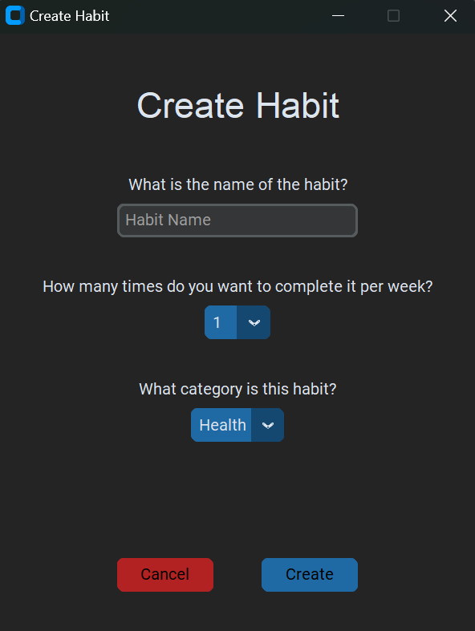
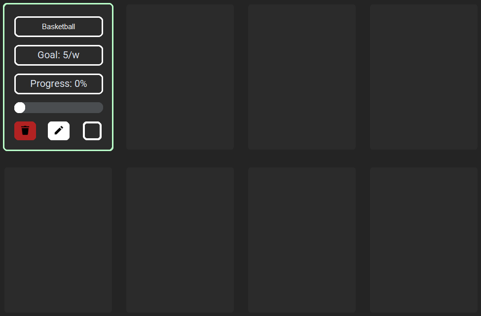
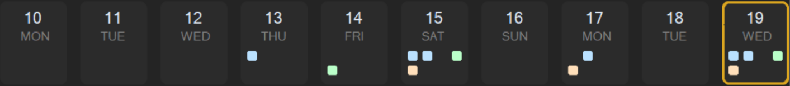

# Habit Tracker App
By Leo Mitchell

## Project Description
Habit Tracker App is a python-based application used for creating, tracking and editing your daily habits. The program utilises Tkinter and customtkinter libraries for the graphical user interface. The application can be customised to your liking with both a light and dark mode option and supports up to 8 habit slots at one time, each with a name, goal and category assigned to it.



## Installation Instructions
1. Clone the repository

2. Install all the required modules with pip:

```bash
py -m pip install -r requirements.txt
```

## Habit Creation
Upon startup, to create a habit all you have to do is click on the 'Create Habit' button in the bottom right, this will open this pop up:



Here you will then go through each field, entering the name, goal, and category of the habit. Once you are done just click the 'Create' button and your habit should appear in the next available slot as seen here:



## Calendar
The calendar at the top of the screen lists today in the top right and the last 9 days to the left of it, each labelled with a day and date. When you complete a habit an indicator will be displayed in today's calendar box with the same position and colour as the completed habit. If you were to return the next day, the calendar will then display an indicator for that completed habit in the previous day so that you can track your progress over time.

Here is an example:

